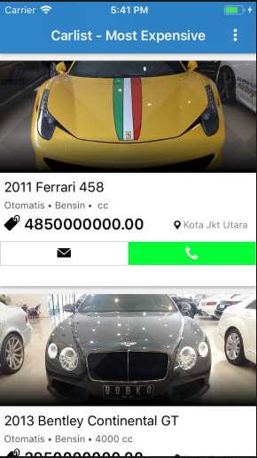
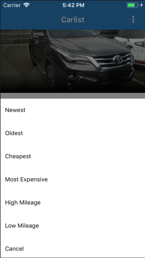

# MobDevTestPrototype/c4rmud1-PH

Mobile Developer Test Prototype for pre-examination for job application.

## Preview Image

<p align="center"> 


</p>

## Getting Started

These repo will get you a copy of the project up and running on your local machine for development and testing purposes.

### Prerequisites

What things you need to install the software and how to install them

```
XCode supported Swift version 3.2
```

## Built With

* [Swift Programming Language](https://developer.apple.com/swift/) - iOS Programming Language
* [CocoaPods](https://cocoapods.org/about) - Dependency Management
* [Alamofire](https://github.com/Alamofire/Alamofire) - HTTP networking library
* [ObjectMapper](https://github.com/Hearst-DD/ObjectMapper) - Convert your model objects to and from JSON.
* [AlamofireObjectMapper](https://github.com/tristanhimmelman/AlamofireObjectMapper) - Converts JSON response data into swift objects.
* [SwiftJSON](https://github.com/SwiftyJSON/SwiftyJSON) - JSON data in Swift.
* [RealmSwift](https://github.com/realm/realm-cocoa) - is a mobile database that runs directly inside phones, tablets or wearables. This repository holds the source code for the iOS, macOS, tvOS & watchOS versions of Realm Swift & Realm Objective-C.
* [NVActivityIndicatorView](https://github.com/ninjaprox/NVActivityIndicatorView) - is a collection of awesome loading animations. 

## Versioning

- Carlist v.1.0

## Authors

* [Adrian Millena](https://www.facebook.com/drey01819) 

## License

This project is licensed under the MIT License - see the [LICENSE.md](LICENSE.md) file for details

## Acknowledgments

* C 4 R M U D 1 - PH

